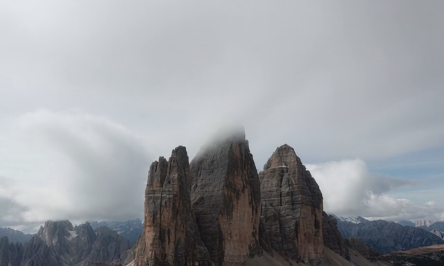
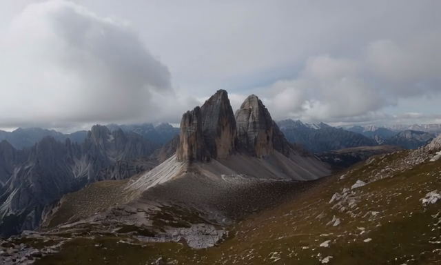
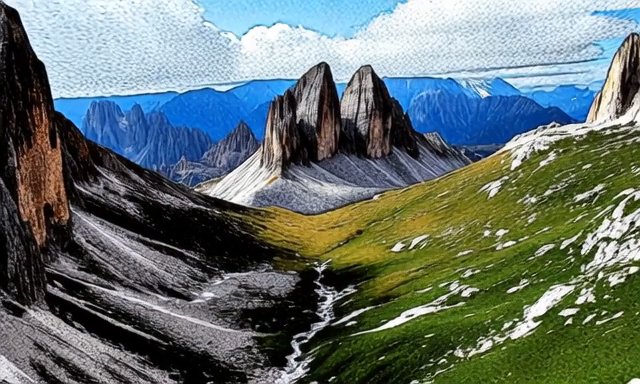

<div align="center">

<h1>InfinityEdit: Infinite Video Editing with a Lightweight Edit-Ignition Adapter</h1>

[](https://arxiv.org/abs/2608.20910)
[](https://yunzetong.github.io/InfinityEdit)
[](https://huggingface.co/BestWishYsh/Helios-Distilled)
[](LICENSE.txt)

Yunze Tong<sup>1,&#42;</sup>, Mushui Liu<sup>1,2,&#42;,&dagger;</sup>, Canyu Zhao<sup>1</sup>, Shiyi Zhang<sup>2</sup>,
Didi Zhu<sup>1,3</sup>, Peng Zhang<sup>2</sup>, Wanggui He<sup>2</sup>, Jinlong Liu<sup>2</sup>,
Ying Chen<sup>2</sup>, Hao Jiang<sup>2,&dagger;</sup>, Pipei Huang<sup>2</sup>, Bo Zheng<sup>2</sup>

<sup>1</sup>Zhejiang University &nbsp;&nbsp; <sup>2</sup>Alibaba Group &nbsp;&nbsp; <sup>3</sup>Imperial College London

<sup>&#42;</sup>Equal contribution &nbsp;&nbsp; <sup>&dagger;</sup>Corresponding author

</div>

## Overview

InfinityEdit studies infinite video editing: one instruction after another,
applied to a continuing video stream. Instead of rewriting a fixed source clip
frame by frame, each edit produces the next segment of the stream, and later
edits build on the already edited history.

This repository contains the training code and the multi-round inference
pipeline.

## Demo Videos

Each case is shown as a left-to-right editing chain: every instruction is applied
to the clip before it and produces the next stream segment. For more demo videos,
please check the [project page](https://yunzetong.github.io/InfinityEdit).

<h3 align="center">Long Video Generation</h3>

<table>
  <tr>
    <td colspan="5" align="center">
      <b>Pianist in an opulent room - Simpsons style, then Labubu toy</b>
    </td>
  </tr>
  <tr>
    <td align="center">
      <a href="https://yunzetong.github.io/InfinityEdit">
        
      </a><br>
      <b>Source</b>
    </td>
    <td align="center">
      <b>Simpsons<br>comic style</b><br><br>
      &rarr;
    </td>
    <td align="center">
      <a href="https://yunzetong.github.io/InfinityEdit">
        
      </a><br>
      <b>Edit 1</b>
    </td>
    <td align="center">
      <b>Labubu<br>designer toy</b><br><br>
      &rarr;
    </td>
    <td align="center">
      <a href="https://yunzetong.github.io/InfinityEdit">
        
      </a><br>
      <b>Edit 2</b>
    </td>
  </tr>
</table>

<h3 align="center">Infinite Sequential Editing</h3>

<table>
  <tr>
    <td colspan="7" align="center">
      <b>Tre Cime di Lavaredo peaks - move up, zoom out, then American comic</b>
    </td>
  </tr>
  <tr>
    <td align="center">
      <a href="https://yunzetong.github.io/InfinityEdit">
        
      </a><br>
      <b>Source</b>
    </td>
    <td align="center">
      <b>Move up</b><br><br>
      &rarr;
    </td>
    <td align="center">
      <a href="https://yunzetong.github.io/InfinityEdit">
        
      </a><br>
      <b>Edit 1</b>
    </td>
    <td align="center">
      <b>Zoom out</b><br><br>
      &rarr;
    </td>
    <td align="center">
      <a href="https://yunzetong.github.io/InfinityEdit">
        
      </a><br>
      <b>Edit 2</b>
    </td>
    <td align="center">
      <b>American<br>comic style</b><br><br>
      &rarr;
    </td>
    <td align="center">
      <a href="https://yunzetong.github.io/InfinityEdit">
        
      </a><br>
      <b>Edit 3</b>
    </td>
  </tr>
</table>


---

## News

- **2026-08-21** - arXiv preprint released.
- **2026-08-24** - Code release prepared.

---

## Installation

```bash
conda create -n infinityedit python=3.11 -y
conda activate infinityedit
pip install -r requirements.txt
```

### Base model

The frozen backbone is [**Helios-Distilled**](https://huggingface.co/BestWishYsh/Helios-Distilled)
(VAE + transformer + T5 text encoder + tokenizer, in diffusers layout):

```bash
huggingface-cli download BestWishYsh/Helios-Distilled --local-dir ./pretrained/Helios-Distilled
```

The configs expect it at `./pretrained/Helios-Distilled`; set
`model_config.pretrained_model_name_or_path` to move it elsewhere.

---

## Repository layout

```
configs/                        training configs + accelerate configs
  edit_adapter_phase1.yaml        Stage 1 (uniform sigma weighting)
  edit_adapter_phase2.yaml        Stage 2 (low-sigma focus + temporal reweighting)
  accelerate_multi_gpu_*.yaml     8 / 16 / 32 GPU launchers

helios/                         model + data code
  modules/transformer_helios.py         frozen backbone
  modules/transformer_helios_edit.py    backbone + Edit Adapter
  modules/edit_adapter.py               the adapter itself
  dataset/dataloader_edit_adapter.py    latent dataset
  utils/                                sigma sampling, history prep, EMA, ...

train_edit_adapter.py             trainer (both stages)
run_edit_adapter_inference.py     single-round inference + shared denoise helpers
sequential_edit/
  run_sequential_edit.py            multi-round sequential editing

examples/
  benchmark.csv                     sequential-edit instructions (2 example clips × 3 rounds)
  videos/                           two sample source videos for quick testing

scripts/
  preprocess/encode_edit_dataset.py        video pairs -> VAE latents + T5 embeddings
  preprocess/run_encode_edit_dataset.sh
  train_phase1.sh / train_phase2.sh
  run_sequential_edit.sh
```

---

## 1. Data Preparation

Training uses pre-encoded VAE latents and text embeddings. Prepare one CSV per
edit style under `data/edit_pairs/`:

| column | meaning |
| --- | --- |
| `src_video_path` | path to the original video |
| `tgt_video_path` | path to the edited video |
| `src_video_caption` | caption describing the scene |
| `edit_video_instruction` | the edit instruction |

Then run:

```bash
bash scripts/preprocess/run_encode_edit_dataset.sh --all
```

The encoded files are written to `data/train/<style>/*.pt`. If your paths differ,
edit `SRC_ROOT`, `DST_ROOT`, and `MODEL_PATH` in the preprocessing script.

---

## 2. Training

InfinityEdit trains the adapter in two stages. Stage 1 learns the basic editing
ability. Stage 2 resumes from Stage 1 and refines low-noise details.

```bash
bash scripts/train_phase1.sh

# Set `resume_from_checkpoint` in configs/edit_adapter_phase2.yaml first.
bash scripts/train_phase2.sh
```

Before launching, set `DATA_ROOT`, `NUM_GPUS`, and `STYLES` in the shell scripts.
Checkpoints and logs are written under the configured `output_dir`.

---

## 3. Inference

```bash
bash scripts/run_sequential_edit.sh
```

Set `ADAPTER_CKPT`, `BASE_MODEL_PATH`, `DATA_DIR`, and `TEST_CSV` at the top of
the script. `DATA_DIR` can point to raw `.mp4` source videos or pre-encoded
latents. Outputs are saved under `outputs/sequential_edit_*`:

```
sample_XXXX/
  source.mp4
  edit_1_<type>.mp4
  edit_2_<type>.mp4
  edit_3_<type>.mp4
  full_video.mp4
  generated_full.mp4
  metadata.txt
```

---

## Acknowledgements

This work builds on several excellent open projects. We thank the authors of
[Helios](https://huggingface.co/BestWishYsh/Helios-Distilled) and
[Wan](https://github.com/Wan-Video/Wan2.1) for the video diffusion backbones,
[UltraVideo](https://huggingface.co/datasets/APRIL-AIGC/UltraVideo) for the
training data, and [VBench](https://github.com/Vchitect/VBench) for evaluation.

## License

Released under the Apache 2.0 License — see [LICENSE.txt](LICENSE.txt).

## Citation

If you find this work useful, please cite:

```bibtex
@article{tong2026infinityedit,
  title={InfinityEdit: Infinite Video Editing with a Lightweight Edit-Ignition Adapter},
  author={Tong, Yunze and Liu, Mushui and Zhao, Canyu and Zhang, Shiyi and Zhu, Didi and Zhang, Peng and He, Wanggui and Liu, Jinlong and Chen, Ying and Jiang, Hao and Huang, Pipei and Zheng, Bo},
  journal={arXiv preprint arXiv:2608.20910},
  year={2026}
}
```
